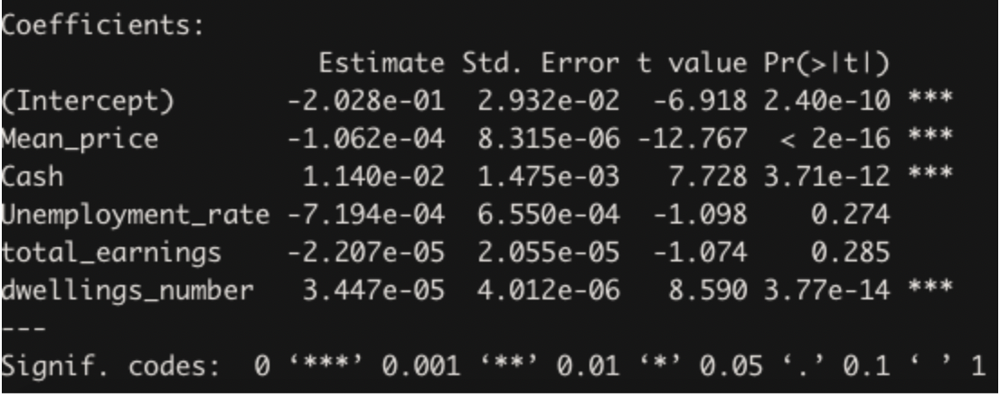
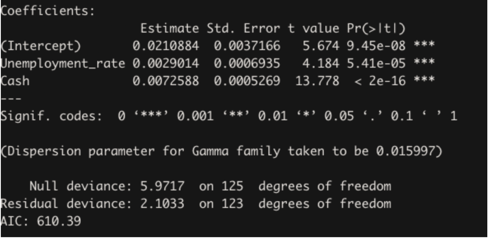
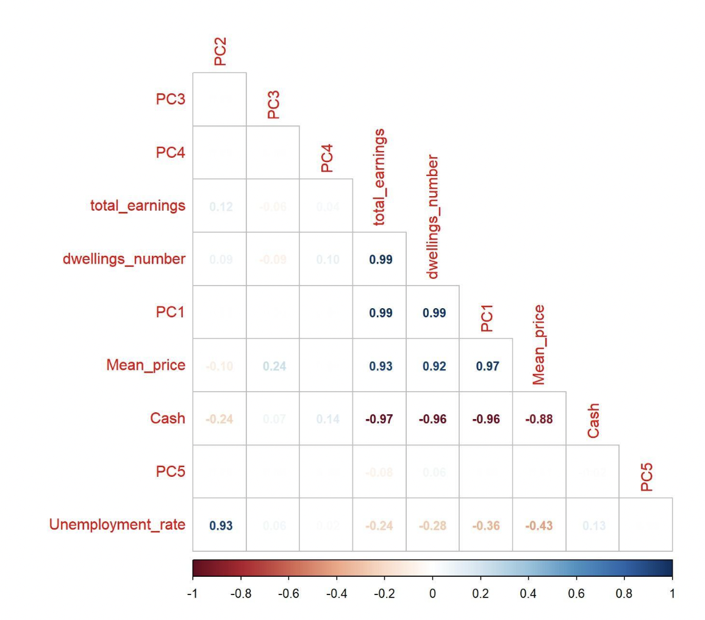
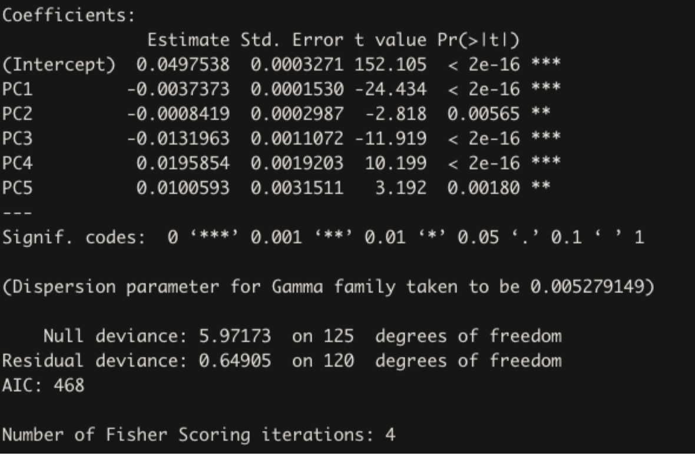

```{r setup, include=FALSE}
knitr::opts_chunk$set(echo = TRUE)

```

```{r, echo=FALSE, message=FALSE, warning=FALSE}
source("rmd_import.R")
```

## Group Members

1. 14214213 | Angy Melissa Medina Berrio
2. 24592154 | Thi Huong Tra Le
3. 24600088 | Phoebe Jacinda Santoso
4. 24586556 | Divgun Singh
5. 24608376 | Rabin Poudyal
6. 24591214 | Daniel Alexander 
7. 13745144 | Chau Tran

Word count: 5000 words
\newpage

## Executive Summary 
Housing price is a complicated statistic, especially in today’s dynamic world where the property market has been influenced by numerous factors such as government policy, employment rate, catastrophic events like pandemics and much more. Not only it is difficult to forecast the future trends in housing but also to understand the historic trends given the limited number of variables influencing house price and new loans commitment can be measured for analysis. Our discussion in this paper will focus on five variables (Mean housing price, Reserve Bank of Australia (RBA)’s Cash Rate, Dwellings Number, Employment Rate, and Total Earnings) and how they have influenced the housing market (referred as Total Loans in dollars) variable over the past years from 2012 to 2022. We have used various statistical approaches like residual plots, Q-Q plots, Principal Component Analysis and more to help us uncover the housing patterns and get the best possible model. Our approach will focus on figuring out if the variables are statistically significant using a hypothesis test (where we think they are significant) rather than the prediction approach. We found that all of the above mentioned variables have impacts on home buyers’ confidence. Additionally, there are several parties and factors who also play significant roles in driving the housing market.


\newpage

## Table Of Content

1. Introduction
2. Methodology \newline
	  2.1 Data acquisition
3. Exploratory Data Analysis and Visualisations
4. Hypothesis
5. Modelling
6. Results
7. Discussion
8. Conclusion

\newpage

## Introduction
The Australian economy has become so sophisticated that the demand for residential buildings in Australia is intertwined with many factors including interest rates, amount of disposable income, affordability, dwellings supply and many others. Understanding this relationship has become more important as the industry contributes more than $150 billion per annum towards the Australian economy, and the fact that most of the profits in the banking industry comes from home loans. As widely known, the interest rate can be considered as the solely key factor for the behaviours of Australian mortgage borrowers. People might easily assume that the best time to jump into the property market is when the Reserve Bank of Australia (RBA) lowers the cash rate. However, that is not always the case since the impact of different underlying factors remains unknown. A recent example has shown that the housing market is very sensitive to the interest rate, and it has responded accordingly to the changes of interest rate made by the RBA throughout the pandemic (Halmarick & Aird, 2020). The RBA cut the interest rate to the lowest level in history at 0.1% in 2021, leading to the highest level of new loan commitments during this time.

### Project aims and objectives
 
This project is aimed at researching further into those economic factors such as cash rate, loan commitments, incomes, dwellings number and dwellings price from 2012 until recent to have a bigger picture and more insightful information about the trends, the relationships and the impacts of these factors to the property market. To support our project aim, we asked the following questions:

1. To what extent the cash rate policies from the RBA affect the confidence of home buyers in Australia from 2012 until 2022 (June)?

2. How significant are the following factors: household income, unemployment rate and house price have an impact on buyers’ decision to secure their home loan during this period?

## Methodology

### Data Acquisition
Before one can start with the analysis part, they need a key ingredient to start with i.e. data. Data can be acquired through various sources keeping in mind the integrity of the source and the richness of information because that eventually affects the analysis and decisions made for critical businesses. We collected most of the datasets from the Australian Bureau of Statistics (abs.gov.au) website and the Reserve Bank of Australia website, which satisfies all the prerequisites of richness, reliability, safety and truthiness of data. More details about each dataset are presented in the below table: 


| Number | Name of data set                              | Name of variable it represents         | Response/ Explanatory variable | Date range            | Number of entries | Research question |
| :----: | :-------------------------------------------- | :------------------------------------- | :----------------------------: | :-------------------- | :---------------: | :---------------: |
|   1    | New loan commitments for total housing        | New loan commitments for total housing |     Response variable (y)      | 01/06/2004-01/06/2022 |        218        |      1 and 2      |
|   2    | Cash rate - Reserve Bank of Australia         | Cash rate                              |   Explanatory variable (x1)    | 01/09/2011-01/08/2022 |        122        |      1 and 2      |
|   3a   | Mean price of residential dwellings Australia | Mean price of residential dwellings    |   Explanatory variable (x2)    | 01/09/2011-01/03/2022 |        44         |         2         |
|   3b   | Mean price of residential dwellings Australia | Number of residential dwellings        |   Explanatory variable (x3)    | 01/09/2011-01/03/2022 |        44         |         2         |
|   4    | Residential Property Price Index              | Residential Property Price Index       |   Explanatory variable (x4)    | 01/09/2003-01/12/2021 |        75         |         2         |
|   5    | Average Weekly Earnings                       | Average Weekly Earnings                |   Explanatory variable (x5)    | 01/11/1994-01/05/2022 |        57         |         2         |
|   6    | Labour Force Australia                        | Unemployment rate                      |   Explanatory variable (x6)    | 01/02/1978-01/07/2022 |        535        |         2         |
|   7    | Months                                        | Date                                   |              N/A               | 01/11/2011-01/06/2022 |        129        |      1 and 2      |

### Data Manipulation and Summaries
The six datasets representing seven variables (New loan commitments for total housing, Cash rate, Mean price of residential dwellings, Number of residential dwellings, Residential Property Price Index, Average Weekly Earnings and Unemployment rate) are merged under one dataset called 'merged_dataset' using the relevant and essential r libraries from the mentioned packages which includes ‘readxl’, ‘tidyverse’, ‘lubridate’, ‘imputeTS’, ‘corrplot’, ‘datasets’, ‘DGLMExtPois’, ‘bbmle’, etc.
The missing values in the dataset are handled by using two techniques namely ‘Weighted Moving Average’ and ‘Top to Bottom’. The former uses the mean which is calculated keeping equal weights for all observations in the moving average window, whereas the latter helps by filling the previous or next entry and is useful in common output format where values are not repeated.

## Exploratory Data Analysis and Visualisations

## Correlation Matrix

```{r}
# correlations of the variables
corr_matrix <- cor(clean_dataset[, c(2:8)])
corrplot(corr_matrix,
  method = "number", type = "lower", insig = "blank",
  addCoef.col = "black", number.cex = 0.8, order = "AOE", diag = FALSE
)
```

This graph above depicts the correlation coefficients between all the possible 
pairs of variables available in the cleaned dataset. Correlation coefficients are a 
measure of linear associativity between two variables ranging from -1 to +1. +1 
depicts that there is a perfect positive linear relation between two variables 
whereas -1 shows the negative linear relation and 0 explains non-linear 
relationship. For instance, we can see dwelling_numbers and total_earnings are 
positively linear related and so is the case with Mean_price and price_index with 
a coefficient value of 0.99, likewise Total_loans have strong positive correlation 
with total_earnings, dwellings_number, price_index and mean_price with 
coefficients as 0.72, 0.68, 0.83 and 0.86 respectively. Whereas there is negative 
linear correlation between Total_loans and cash, Unemployment_rate with 
coefficients of -0.72 and -0.34 respectively.


```{r}

# 4 plots in a grid
q1 <- ggplot(clean_dataset, aes(y = Total_loans, Date)) +
  geom_line()
q2 <- ggplot(clean_dataset, aes(y = Cash, Date)) +
  geom_line()
q3 <- ggplot(clean_dataset, aes(y = Unemployment_rate, Date)) +
  geom_line()
q4 <- ggplot(clean_dataset, aes(y = total_earnings, Date)) +
  geom_line()

plot_grid(q1, q2, q3, q4)
```

Continuous fall in cash rate was because of the tightened lending standards 
and the continuous fallout from the banking royal commission and stringent 
assessments which led to delay in loan processing and approvals from finance 
department (Chalmers, 2018). This also resulted in the decrease in total 
number of loans during the period starting from 2017 – 2019 where RBA 
suggested welcoming people to increase house demands which will eventually 
result in a substantive jump in house prices but low cash rates will help build 
the confidence of home buyers (Shane Oliver, 2019).

Furthermore, total earnings of an individual or household has seen an upward 
trend overtime because it is driven by the arising employment growth, growth 
in earnings of labour force, increased wages and more hours being put up by 
part-time workers. This not only makes houses more affordable but also 
improves the chances of an individual getting loans easily (Figure 2).

### Relationship between response variable (new loan commitments) with other explanatory variables. 

#### Effect of Cash Rate on Total Number of loans

```{r}
clean_dataset %>%
  ggplot(aes(Cash, Total_loans )) + geom_point(mapping = aes(x =Cash , y = Total_loans)) +geom_smooth(color ="Blue") +labs(title = "Decreasing Cash Rate resulting in increased \nnumber of loans from 2012-2022 ")
```

Image above shows how cash rate effects the total number of loans 
with a negative correlation coefficient of -0.72 which explains why total loans 
or the confidence of home buyers goes and so is the demand leading to the 
decrease in borrowing capacity of an individual because of increase in cash 
rate resulting in higher loan payments. 

#### Number of loans vs Household Earnings

```{r}
clean_dataset %>%
  ggplot(aes(total_earnings, Total_loans )) + geom_point(mapping = aes(x =total_earnings , y = Total_loans, color = Date)) +geom_smooth(color ="Red") +labs(title = "Increasing Total Earnings results in increase \nin number of loans from 2012-2022 ")

```

It is evident from the data and positive correlation coefficient of 0.72 that 
when total earnings of a household increases, houses become more 
affordable to the family which results in increasing the demand in the market
leading to high number of total loans.

#### Effect of mean price and price index on total number of loans

```{r}
ggplot(clean_dataset, aes(x=Mean_price, y=Total_loans)) + geom_point() + labs(title="Mean price vs total loans", x="Mean price", y="Total loans")
```

```{r}
ggplot(clean_dataset, aes(x=price_index, y=Total_loans)) + geom_point() + labs(title="Total Loans vs price index", x="Price Index", y="Number of Total Loans")
```

Mean price and price index have a positive correlation coefficient of 0.86 and 
0.83 respectively with the total number of loans. The high amount of houses 
as evident from increasing mean price of dwellings and the price index pushes
customers to take help from bank, increasing the total number of loans.

### Relationship between the explanatory variables.

#### Cash Rate and Mean Price 

```{r}
clean_dataset %>%
  ggplot(aes(Cash, Mean_price)) +
  geom_point(size = 2, alpha = 2) + labs(title = 'Relationship of Cash rate and Mean Price', subtitle = 'November 2011 - June 2022') +
  xlab("Cash rate (months)") +
  ylab("Mean price")
```

There appears to be a strong negative relationship between the cash rate and the mean price of residential dwellings (correlation coefficient = - 0.88). To further explain, when the cash rate increases, it will increase the amount of loan payment of home buyers and reduce their borrowing capacity. Which results in lower demand for buying houses. When the demand is low, the price will decrease over time to attract more buyers coming back to the market. 


#### Total Earnings and Dwellings Number

```{r}
clean_dataset %>%
  ggplot(aes(total_earnings, dwellings_number)) +
  geom_point(size = 2, alpha = 2) + labs(title = 'Relationship of Total earnings and Number of Residential Dwellings', subtitle = 'November 2011 - June 2022') +
  xlab("Total earnings (months)") +
  ylab("Dwellings number")
```

We can see that there is quite a clear upward slope showing a strong positive relationship between Total earnings and the number of residential dwellings (correlation coefficient = 0.99). To explain, when the income of the buyers increases, buying houses become more affordable for them (they can save more money, and have higher borrowing capacity). This results in higher demand for buying houses, which consequently has an impact on the number of residential dwellings as construction companies and the government need to increase the supply by building more houses to support that demand.

#### Total Earnings and Mean Price of dwellings

```{r}
clean_dataset %>%
  ggplot(aes(total_earnings, Mean_price)) +
  geom_point(size = 2, alpha = 2) + labs(title = 'Relationship of Total earnings and Mean price of residential dwellings', subtitle = 'November 2011 - June 2022') +
  xlab("Total earnings (months)") +
  ylab("Mean Price")
```

This also happens when we compare the relationship between the total earnings and the mean price of residential dwellings. When the demand for buying houses get higher due to the increase in their earnings, it will drive the price of houses to increase accordingly. The upward slope in this graph clearly represents this positive relationship (correlation coefficient = 0.93).

## Hypothesis
One of the ways for the government to control the money flow is by controlling the cash rate, it is called the monetary policy. The Reserve Bank of Australia ( RBA ) (2017) suggests that most of the loans in Australia can be influenced easily by the change of cash rate. Moreover a research held by JP Morgan in 2017 indicated that a decrease in interest rate will result in an increase in consumer spending. Hence, we hypothesise that the level of the cash rate affects the total loans committed by Australians.

Similarly, the Australian Parliament House releases a journal that indicates unemployment rate, wage index, the availability of housing, and the property market pricing play important roles in the housing loan market. Our second hypothesis is that the changes in unemployment rate, earning capacity, dwelling numbers, and the housing price are interconnected with the loan commitment trend.

## Model
The models performed for this task include Multiple Linear Regression and Generalised Linear Models, with the assistance of Principal Component Analysis .Ggpairs is utilised in this process due to its ability to show correlation values of the pairs, scatterplots of the pairs, and the density plots of the pairs.

### Multiple Linear Regression Approach 

Multiple Linear Regression (MLR) is a statistical technique utilised to discover the relationship between the response variable (total loans) and the explanatory variables. lm() functions in R were performed to achieve the best fit for the models for this task. The terms of inclusion vary depending on their performance after being fitted. This approach was performed to see if it would fit the data well and produce a viable result.

MLR follows five assumptions, and any violated assumption could potentially result in the unreliability of the result (Statology, 2021).
The five assumptions of MLR:
Linear relationship		: Relationship between the response and explanatory variables must be linear
No multicollinearity		: Explanatory variables should not have high correlation with each other
Independence		: Explanatory variables must be independent
Homoscedasticity		: Residuals must have constant variance
Normally distributed	: The residuals must be normally distributed
Despite having a total of 17 different formulas for fittings, only 1 model had a low multicollinearity score due to their independent nature. However, this model cannot be selected due to the incompleteness of the chosen explanatory variables, resulting in its inability to answer the research question well. The other models, including the full model (Total_loans ~ Mean_price + Cash + dwellings_number + Unemployment_rate + total_earnings), did not meet the assumptions of MLR.

### Multilinear regression

```{r}
linear_mod <- lm(formula2, data = data)
summary(linear_mod)

#The confidence interval of the model 
confint(linear_mod)

#Assumption of linear regression // https://www.statology.org/linear-regression-assumptions/

#linearity of the data - Residual vs Fitted plot
plot(linear_mod, 1) 
#the residuals are not randomly scattered around the center line of zero
#seems the variance is not constant
#error should not be approx normally distributed
```

```{r}
#independence of the predictors// there is no correlation between the residuals, e.g. the residuals are independent
#perform Durbin-Watson test//https://www.statology.org/durbin-watson-test-r/
durbinWatsonTest(linear_mod)
#p-value is 0. Since this p-value is less than 0.05, we can reject the null hypothesis and conclude that the residuals in this regression model are autocorrelated


# residuals errors have constant variance - Homoscedasticity
plot(linear_mod, 3)
#seems we have heteroscedasticity - the results of the analysis become hard to trust/  to declare that a term in the model is statistically significant, when in fact it is not.
#heteroscedasticity. This means that the variability in the response is changing as the predicted value increases. observations with larger errors will have more pull or influence on the fitted model
#common sol is to calculate log or square root transformation/ formula_mod14 still have heteroscedasticity
#We can also use the Non- Constant Error Variance (NVC) Test
ncvTest(linear_mod)

#normality - residuals are normally distributed
#q-q plot/ quantile-quantile plot/ to determine whether or not the residuals of a model follow a normal distribution
#If the points on the plot roughly form a straight diagonal line, then the normality assumption is met
#we also can use formal statistical tests like Shapiro-Wilk, Kolmogorov-Smironov, Jarque-Barre, or D’Agostino-Pearson / these tests are sensitive to large sample sizes
plot(linear_mod, 2)
#check distribution of the residuals
hist(residuals(linear_mod), col = "steelblue")
#left skewed


#independence of observations
#identify influential observations
#Residuals vs. Leverage Plot - cook's distance //https://www.statology.org/residuals-vs-leverage-plot/
#to the extent to which the coefficients in the regression model would change if a particular observation was removed from the dataset.
plot(linear_mod, 4)
#there are influential points/ Influential observations could indicate that the model you specified does not provide a good fit to the data

#to sum up
par(mfrow = c(2, 2))
plot(linear_mod)
```


Generalised Linear Model Approach
As the residuals for MLR did not meet some of the assumptions, the alternative is to use the Generalised Linear Model (GLM). Just like the normal linear regression, GLM also has the objective of observing the relationship between the –continuous– response and explanatory variables, but via a link function. 
The assumptions in GLM are:
The response variable is a continuous variable
The transformed response variable is linearly related to its feature variables
Error is normally distributed and variance is constant (homoscedastic)
Independence of residuals
No collinearity between predictors
Several families in GLM can be utilised to execute the models, such as gaussian (the default one), inverse gaussian, gamma, and some other families. Gaussian is one of the most used ones. Yet sometimes despite the response variable being continuous, the normal distribution assumption is not met. In addition, there are times when the response can only take nonnegative values, and the variance is not constant. According to a paper by University of Tartu, other distributions such as gamma and inverse gaussian might be better suited in such scenarios.

GLM with Gaussian Family
Using the full formula, the VIF values (to detect multicollinearity) exceed the threshold, which is 5. In fact, 4 out of 5 predictors have VIF values bigger than 5, indicating high multicollinearity, which could lead to a wrong interpretation in the significance of the variables.
```{r}
#GLM with gaussian family
gauss_mod <- glm(formula = formula2 , data = data, family = "gaussian")


#Calculating residuals
residuals <- resid(gauss_mod)

#Residual Plot fitted vs residuals
plot(fitted(gauss_mod), residuals)

#Q-q plot and density plot
qqnorm(residuals)
plot(density(residuals))

par(mfrow = c(2, 2))
plot(gauss_mod)

#Multicollinearity
car::vif(gauss_mod)
```


GLM with Gamma Family
Similar to GLM with the Gaussian family, most of the VIF values for this model also exceed the threshold, indicating high multicollinearity.
```{r}
gamma_mod = glm(
  formula = formula2,
  family = Gamma, 
  data = data)

summary(gamma_mod)
#glm gamma_full AIC 468
#GLM Gamma formula1 AIC 525
#GLM Gamma formula2 AIC 466
#GLM Gamma formula4 AIC 624.29

#Plotting the 4 graphs necessary for assumption check
par(mfrow = c(2, 2))
plot(gamma_mod)

#Checking for multicollinearity
car::vif(gamma_mod)
```


GLM with Inverse Gaussian Family
Similar to the previous two models, the multicollinearity for this model is high, violating the non-collinearity between predictors assumption.
```{r}
inv_mod = glm(
  formula = formula2,
  family = inverse.gaussian, 
  data = data)

summary(inv_mod)

#Plotting the 4 graphs necessary for assumption check
par(mfrow = c(2, 2))
plot(inv_mod)

#Checking for multicollinearity
car::vif(inv_mod)
```


PCA
To take advantage of the full model while having low multicollinearity simultaneously, Principal Component Analysis (PCA) was applied to achieve this ideal. PCA combines correlated variables into a set of uncorrelated variables. Although the principal components obtained after compressing correlated variables require further interpretation to figure out which original variables are related to each principal component, they perform pretty well in removing the correlation between feature variables.

PCA Model Selected

formula_pca3 = Total_loans ~ PC1 + PC2 + PC3 + PC4 + PC5

Since in PCA it is unclear what each principal component constitutes, trying to find the correlation plot between each component with the original explanatory variable helps clear the confusion regarding the content. PC1 is correlated to total earnings, dwelling numbers, mean price, and cash, indicating the existence of all these variables in PC1.

In addition, there is no collinearity between each principal component, allowing this model to include all the original variables without having any multicollinearity.


The plots produced by this model show a little bias in the residuals, as evident from the Residuals vs. Fitted graph. However, the band is still mostly horizontal around the 0 line, signifying that the variance of the residuals is constant. In addition, despite the thick-tailed graph in the Q-Q plot, there is no evidence to reject the normality of the model. According to the Scale-Location graph, the red line is also roughly horizontal, indicating the homoscedasticity assumption is satisfied, and the residuals also show no clear pattern. There is also no data point outside the Cook’s distance, indicating no outliers having the ability to impact much of the result. No assumptions are violated by this model according to the plots.


From the statistical analysis standpoint, it can be inferred that all principal components of the model are significant, as evident from the p-value result. The low value of the residual deviance further indicates that the model built is a good fit. As there is no evidence to reject this model, it is safe to proceed using this model to answer the hypothesis tests.


```{r}
#model applying PCA
pca <- prcomp(data[,c(2:6)], center = TRUE,scale. = TRUE)

summary(pca) #Importance of components
attributes(pca)

pca$scale #use for normalization

#extracting the new features
x <- pca$x

#joining the whole data
#data_pca <- data.frame(data[,c(1:2)], x[,c(1:4)], data[,c("Total_loans")] )

data_pca <- data.frame(x[,c(1:5)], data[,c("Total_loans")] )

#delete outliers rows 101 102 113
#data_pca <- data_pca[-c(101,102,113),]

#rename column
colnames(data_pca)
data_pca <- rename(
  data_pca, 
  Total_loans = "data...c..Total_loans...")
  #,Date = "data...c.1.1..")

# correlations between the principal components and the original variables
#//https://online.stat.psu.edu/stat505/lesson/11/11.4
#//https://reader.elsevier.com/reader/sd/pii/S0169743901002039?token=6588695C5B8FF0C572ADC0B7AE588ACC1A2D170382E23C05124DEB9FFA67F85EC4129732D75758328800CE44D1682D93&originRegion=us-east-1&originCreation=20220928072020
#https://www.sciencedirect.com/science/article/pii/S0169743901002039
full_data <- data.frame(data[,c(2:6)], x[,c(1:5)])

corr_matrix = cor(full_data)
corrplot(corr_matrix, method = 'number', type = 'lower', insig='blank',
         addCoef.col ='black', number.cex = 0.8, order = 'AOE', diag=FALSE)

formula_pca3 = Total_loans ~ PC1 + PC2 + PC3 + PC4 + PC5 # selected formula

#training model
gamma_mod_pca = glm(
  formula = formula_pca3,
  family = Gamma, 
  data = data_pca)

summary(gamma_mod_pca)

#Plotting the 4 graphs necessary for assumption check
par(mfrow = c(2, 2))
plot(gamma_mod_pca)

#Checking for multicollinearity
car::vif(gamma_mod_pca)

#########inverse gaussian + pca
inv_mod_pca = glm(
  formula = formula_pca3,
  family = inverse.gaussian, 
  data = data_pca)

summary(inv_mod_pca)

#Plotting the 4 graphs necessary for assumption check
par(mfrow = c(2, 2))
plot(inv_mod_pca)

#Checking for multicollinearity
car::vif(inv_mod_pca)
```


## Results

### First Approach
We are exploring the possibility of the gamma family GLM with 5 explanatory variables : cash rate, unemployment rate, earning rate, property prices, and the availability of the housing

Null hypothesis: The changes in cash rate, unemployment rate, earning rate, property prices, housing availability will affect the total new loans committed. 

Alternative hypothesis: There is no effect on the changes in cash rate, unemployment rate, earning rate, property prices, housing availability with regards to new loans commitment.

Test Statistics: We set our significance level to 5%



Hypothesis result: Based on our model, it appears that Cash, property price, and the availability of the property are significant at 5% while unemployment rate and wage index are not significant given the other variables are present.


However, multicollinearity is high here, raising concern regarding the accuracy of the coefficient significance, therefore, we try a different approach, where we reduced the model using only variables with low multicollinearity.

Variance inflation factors: to check the multicollinearity


### Second Approach
Here is the variance inflation factors for the second approach, indicating low multicollinearity between those 2 variables:


Null hypothesis: The changes in cash rate and unemployment rate will affect the total new loans committed. 

Alternative hypothesis: There is no effect on the changes in cash rate and unemployment with regards to new loans commitment.

Test Statistics: We set our significance level to 5%



Hypothesis result: The cash rate and unemployment rate are significant at 5%, sufficient evidence to reject the null hypothesis. In other words, there is sufficient evidence to conclude that the changes in cash rate and unemployment rate will have an effect on the new total loans committed.

This approach might produce a better accuracy for the significance of the coefficients due to low multicollinearity. However, we have to sacrifice the other variables of interest to lower the multicollinearity. Then we move to the third approach.


### Third approach:

The approach that we are using here to mitigate the multicollinearity issue is by principal component analysis. By the correlation shown on the graph below, we assume that PC1 represents the earning level, housing availability, cash rate, and the mean price. PC2 represents the unemployment rate.



Null hypothesis: 
The changes in cash rate, unemployment rate, earning rate, property prices, housing availability will affect the total new loans committed. 

Alternative hypothesis: 
There is no effect on the changes in cash rate, unemployment rate, earning rate, property prices, housing availability with regards to new loans commitment.

Test Statistics: 
We set our significance level to 5%



Hypothesis result: 
From PC1 it seems like earning level, housing availability, cash rate, and the mean price are significant at 5%. PC2 indicates that the unemployment rate is significant at 5%. Therefore, our test statistic provides an evidence to suggest that the Cash rate, earning level, housing availability,property mean price, and unemployment rate are significant explanatory variables to the total new loans committed.

## Discussion
As new loans' commitment fluctuated over the years, it is critical to investigate what are the driving factors in each major downturn and upturn. Surprisingly, we found how significant Australian government policies & stimulus, in combination with Australian Prudential Regulation Authority (APRA) can influence the housing market. Other economic and social factors such as the increasing in apartment ownerships, the limited information recorded about the off-the-plan purchases of apartments, the growth in population that we do not have a clear measurement method and data to include in our model, which can potentially explain the accuracy of our model. 


**2014-2016: End of mining boom**
The high demand for coal and iron due to rapid urbanisation and industrialization of emerging economies in Asia (especially China) led to the mining boom in Australian mining industry before 2014 (Country Report Australia: economy slows down | Atradius, 2015). However, since early 2014, China experienced an economic slowdown causing a significant drop in commodity price, massive employee’s layoffs, fall in incomes and low growth in nominal GDP in Australia (Country Report Australia: economy slows down | Atradius, 2015). Meanwhile, other related sectors serving the mining industry also felt the pain (Country Report Australia: economy slows down | Atradius, 2015). This economic downturn put a negative impact on people spending behaviours leading to a lower demand for housing, which declined the housing prices (Country Report Australia: economy slows down | Atradius, 2015). In response to the ripple effect from China’s economy, the Reserve Bank of Australia (RBA) cut interest rates to 2.5% in late 2013 to compensate and to ensure the sustainable growth in the economy (Lorkin, 2015; Kent, 2016).

1.  Decrease in housing affordability since the price was too high
The low level of interest rate since 2013 attracted more home buyers coming back to the market. However, when the demand was too high, house prices started to jump considerably in 2014 and remained very high during 2015 and 2016. It was reported in July 2015 that house prices in Sydney rose 22.9% in just 12 months and the median price hit $1m for the first time (Jabour, 2015). While in Melbourne, house prices were reported to  jump 14.5% over the past year in January 2016 (Zhou, 2016). These extraordinary and skyrocketing prices raised concerns about the housing affordability crisis since people even struggled to find affordable rental accommodation, let alone chances to purchase a house, especially for low-income people or first home buyers (Jabour, 2015; Zhou, 2016).

2.  Increase in the supply and off-the-plan purchase for apartments
Although the housing affordability was getting worse, the demand for new housing remained high and increased by 40% (around 50,000 new dwellings) mostly due to strong population growth, which is an important factor that we did not consider in our report (Kohler & Merwe, 2015). The transition into higher-density housing like apartments was the solution for this. High-density apartments accounted for one-third of all residential building approvals during this time, which made it more affordable for people to own a house since apartments are less expensive than larger, lower-density housing (Shoory, 2016). However, due to the limited information recorded about the off-the-plan purchases of apartments, new loan commitments declined during this period despite the sharp increase in the building approvals for higher-density housing(Leal et al., 2017). These off-plan purchases were made well before construction started or during the construction, thus, there were settlements lags for around one to three years (Leal et al., 2017). Meanwhile, loan commitments are only counted until settlement, implying that new loan commitments are likely to underestimate the actual home buyers’ buying behaviours (Leal et al., 2017).  As a result, loan commitments increased from 2016 to 2017 reflecting the degree of the underestimation of those previous years. The lengthy and complicated planning process as well as the difficulty in infrastructure funding and provision also explain why the increasing supply of apartments could not respond effectively to the high demand for buying houses in the short run, thus, the housing prices in the market still remained at a high level through these years (Kohler & Merwe, 2015). 
 
3. Decline in interstate migration
Another driver for the decline in home loan commitments is the decline in interstate migration (Leal et al., 2017). People tend to move interstate to find a more affordable house as well as lower living expenses. However, the benefits of interstate migration were reduced due to the improvements in technology and the changes in working nature, which makes it more insecure for employment and income (Leal et al., 2017). Moreover, there were an increasing number of apartments built in the areas that were close to employment opportunities, public transports and shopping centres in capital cities like Sydney and Melbourne, which helped home buyers to decide where they wanted to live instead of having to move interstates.

4. Changes in foreign investment policy
Stronger foreign investment rules enforced by the Commonwealth Government is also a crucial factor to explain about the decrease in loan commitments (Government strengthens the foreign investment framework | Treasury Ministers, 2015). Since 01/12/2015, the residential real estate functions have been transferred to the Australian Taxation Office, who is responsible for identifying possible breaches (Government strengthens the foreign investment framework | Treasury Ministers, 2015). Stricter penalties ($127,500 or three-years imprisonment for individuals and $637,500 for companies) were also been implemented to pursue foreign investors who breach the rules (Government strengthens the foreign investment framework | Treasury Ministers, 2015). Foreign investors are not allowed to purchase existing residential properties according to the Australia’s foreign regime (Government strengthens the foreign investment framework | Treasury Ministers, 2015). In addition to this, large Australian banks also ceased lending to foreign buyers seeking mortgages (Shoory, 2016). 

**2017-2018**
Although in the year of 2017 Australian economy was doing great with a growth of 2.8% annually, low interest rates, rises in infrastructure investment for both public and private sectors, the housing market showed a slowdown especially in major cities. This credits to the stricter bank regulations and policies on how investors can approach interest-only loans (Stevenson, 2018).

The shrinkage in national house prices is the result of tighter lending standards from major banks (The Australian Financial Review, 2019). After peaking in 2017, major cities including Sydney and Melbourne showed sharp decreases at 11.1% and 7.2% respectively as the response to financial regulator Apra’s stricting of lending conditions (Zhou, 2019).

**2019: Housing bounce back**
The relaxation in lending standards, along with interest rates cut in the previous year, has triggered more borrowing capacity and allowed many people to get closer to the housing market (Taulaga, 2020). 

**2021-2022 Covid era**
Different Bureau of Statistics data suggest that the reason for house price hike in recent months are first home buyers whose commitment advanced 9.3% in just December 2020 alone with the total number of 15,205 buyers, ending with 56.6% annual increase (ABC News, 2021). With Covid restriction and many uncertainties, many people turn to buying homes as a guaranteed investment. 

Sharp increases in new loans were driven by many factors such as stimulus measures from the government of Home Builder grant ($25,000), low interest rate combined with multiple lockdowns and remote working, pushing the demand for larger accommodations (Burke, 2022). 


## Limitations
As mentioned earlier in the report, studied variables have quite high correlation and this usually leads to the issue of multicollinearity. However, it depends on the degree of multicollinearity that drives the effectiveness of the study (Owusu et al., 2019).
At the same time, Asabere and Huffman (2007) mentioned that it is very common for house price related data to be associated with popular economic issues of multicollinearity. Their research also showed that there is no evidence of significant issues of multicollinearity to the performance of the model. Another study by Bryant (2017) suggests that the high multicollinearity always exists in this type of study given the nature of house price data related variables such as unemployment rate, consumer confidence or building approvals. Further approach needs to be taken to handle this type of data.

Limited number of input variables to analyse might be too subjective to produce a conclusion with high credibility. In this project, we only studied the cash rates, mean price of residential dwellings, average income and unemployment to determine the significance of these variables towards new home buyers’ confidence in committing mortgages. As discussed above, there are other factors such as government policies, housing availability, economic downturn, population and migrations etc. also show high association with the rise and fall of new home loans.


## Stakeholder analysis and project outcomes
Understanding the importance of cash rate, unemployment rate, mean price and average income and their effects on home buyers’ confidence will help banks, property developers / construction companies, home buyers and sellers, and government to perform informative decision making given the changes of these explanatory factors. 
 
A brief outline of potential benefits stakeholders can take away from this project:

- Banks: Inform banks on how the market might react on how much home loan interest rate they are charging the customer. 
- Property developers / Construction companies: Providing indicators on how many resources should be prepared to ensure that the supply meets the demand given the current and prospective economic conditions. 
- Home sellers: Estimation on the home buyers’ confidence in committing loans might help them to adjust their pricing. 
- Government: Providing the government with numerical indicators on how successful their policies have affected the property market and giving them an idea on how those policies need to be adjusted for a more sustainable growth.


## Conclusion
To summarise from the above data analysis and hypothesis tests, we can conclude that the variables cash rate, dwellings number, employment rate and total earnings are significant factors in driving the total loan commitments. There are also other additional factors such as government policies and past events like pandemics that roughly correlate with cash rates and eventually affect the confidence of home buyers. Though only a few limited numbers of factors are studied thoroughly in the report, it can pave the way for future research and implications to predict and plan appropriate strategies to drive the housing market.


## References
Asabere, & Huffman, F. E. (2007). The Relative Impacts of Trails and Greenbelts on Home Price. The Journal of Real Estate Finance and Economics, 38(4), 408–419. https://doi.org/10.1007/s11146-007-9089-8
 
Atkin, T., & La Cava, G. (2017). The transmission of monetary policy: How does it work? | bulletin – september quarter 2017. Bulletin, September. https://www.rba.gov.au/publications/bulletin/2017/sep/1.html
Bryant. (2017). Housing affordability in Australia: an empirical study of the impact of infrastructure charges. Journal of Housing and the Built Environment, 32(3), 559–579. https://doi.org/10.1007/s10901-016-9527-0
 
Burke, K. (2022, February 11). “It’s crazy”: Sydney house prices surge 55 per cent in less than three years. The Sydney Morning Herald. https://www.smh.com.au/property/news/it-s-crazy-sydney-house-prices-surge-55-per-cent-in-less-than-three-years-20220210-p59vck.html
 
Country Report Australia: economy slows down | Atradius. (2015, August 3). Atradius Australia | Credit Insurance & Debt Collection. https://atradius.com.au/reports/country-report-australia.html
Government strengthens the foreign investment framework | Treasury Ministers. (2015, May 2). Home | Treasury Ministers. https://ministers.treasury.gov.au/ministers/joe-hockey-2015/media-releases/government-strengthens-foreign-investment-framework
Halmarick, S., & Aird, G. (2020, November 3). RBA cuts interest rates to deliver economic boost.https://www.commbank.com.au/articles/newsroom/2020/11/rate-cut-delivers-economic-boost.html  
 
Harris, E. (n.d.). Link between interest rates and consumer spending is deeper than thought, study finds. Forbes. Retrieved 1 October 2022, from https://www.forbes.com/sites/elizabethharris/2017/04/25/link-between-interest-rates-and-consumer-spending-is-deeper-than-thought-study-finds/
House prices hit record but analysts warn sellers may “wake up” soon. (2021, January 31). www.abc.net.au. https://www.abc.net.au/news/2021-02-01/home-prices-return-to-record-highs-as-covid-rally-continues/13108044
 
https://twitter.com/shaneoliveramp/status/1135772619326627841. (n.d.). Twitter. Retrieved September 28, 2022, from https://twitter.com/ShaneOliverAMP/status/1135772619326627841
 
Investor retreat from housing market continues. (2018, June 12). ABC News. https://www.abc.net.au/news/2018-06-12/investor-retreat-from-property-market-continues-as-lending-falls/9859476
 
Jabour, B. (2015, July 23). Sydney house prices jump 22% in one year to reach $1m median, report says. the Guardian. https://www.theguardian.com/australia-news/2015/jul/23/sydney-house-prices-jump-22-in-one-year-to-reach-1m-median-report-says
Kent, C. (2016, September 13). After the Boom | Speeches. Reserve Bank of Australia.https://www.rba.gov.au/speeches/2016/sp-ag-2016-09-13.html
 
Kohler, M., & Merwe, M. (2015, September). Long-run Trends in Housing Price Growth | Bulletin – September Quarter 2015. Reserve Bank of Australia. https://www.rba.gov.au/publications/bulletin/2015/sep/3.html
 
Leal, H., Parsons, S., White, G., & Zurawski, A. (2017, March). Housing Market Turnover | Bulletin – March Quarter 2017. Reserve Bank of Australia. https://www.rba.gov.au/publications/bulletin/2017/mar/3.html
Lorkin, J. (2015, January 4). From boom to bust in Australia's mining towns. BBC News.https://www.bbc.com/news/world-australia-30584123
Owusu-Manu, Edwards, D. J., Donkor-Hyiaman, K. A., Asiedu, R. O., Hosseini, M. R., & Obiri-Yeboah, E. (2019). Housing attributes and relative house prices in Ghana. International Journal of Building Pathology and Adaptation, 37(5), 733–746. https://doi.org/10.1108/IJBPA-01-2019-0003
 
Parliament of Australia. (2019). Chapter 4 - Factors influencing the demand for housing – Parliament of Australia. Aph.gov.au. https://www.aph.gov.au/Parliamentary_Business/Committees/Senate/Former_Committees/hsaf/report/c04
Property market ends 2018 with 4.8 per cent fall in house prices: Corelogic. (2019, January 1). Australian Financial Review. https://www.afr.com/property/property-market-ends-2018-with-acceleration-in-price-falls-20190102-h19m8f
 
Shoory, M. (2016, June). The Growth of Apartment Construction in Australia | Bulletin – June Quarter 2016. Reserve Bank of Australia. https://www.rba.gov.au/publications/bulletin/2016/jun/3.html
 
Stevenson, L. (2018, January 18). 2018 Australian property market. Providence Property Group. https://providenceproperty.com.au/australias-property-market-2017-expect-2018/
 
Taulaga, J. (2020, January 23). Canberra median house price records steepest annual growth since late 2017. All Homes Real Estate. https://www.allhomes.com.au/news/cbr-median-house-price-records-steepest-annual-growth-since-late-2017-922565/
 
University of Tartu. (n.d.). Generalized Linear Models. Retrieved September 30, 2022, from https://courses.ms.ut.ee/MTMS.01.011/2019_spring/uploads/Main/GLM_slides_2_exp_family.pdf 
YouTube. (2020). Assumptions of general linear models. YouTube. Retrieved October 1, 2022, from https://www.youtube.com/watch?v=XGhGeWRFw2Y&ab_channel=StatsTree. 
Zach. (2021, November 16). The five assumptions of multiple linear regression. Statology. Retrieved October 1, 2022, from https://www.statology.org/multiple-linear-regression-assumptions/ 
Zhou, C. (2016, January 28). Melbourne house prices up 14.5 per cent in 2015.https://www.domain.com.au/news/melbourne-house-prices-up-145-per-cent-in-2015-20160127-gmc46h/
 
Zhou, N. (2019, January 2). Australian house prices falling at fastest rate in a decade. The Guardian; The Guardian. https://www.theguardian.com/australia-news/2019/jan/02/australian-house-prices-falling-at-fastest-rate-in-a-decade-data-shows
